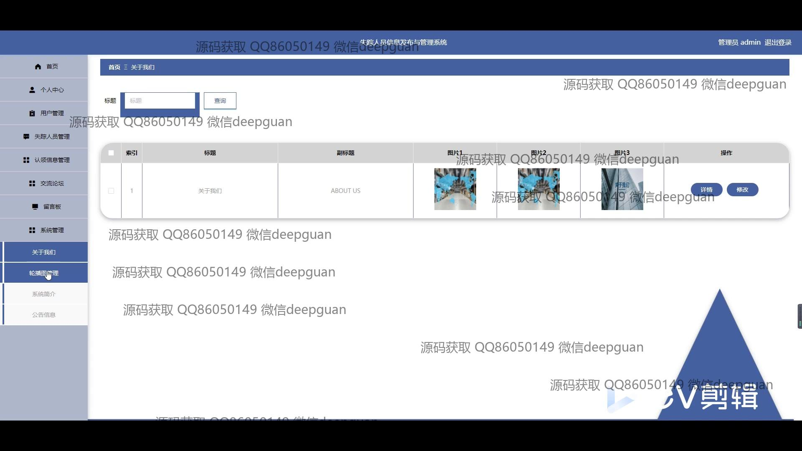

<h1 align="center">失踪人员信息发布与管理系统</h1>

## 简介
失踪人员信息发布与管理系统：管理功能包括信息录入、查询、修改、删除，支持失踪人员的详细资料发布与管理；用户可在系统中查看、评论互动，提供数据统计与交流论坛以助力寻人工作。    --计算机毕业设计源码；毕设源码；java毕业设计源码

## 联系方式

<h3 align="center">获取完整代码与数据库文件 + 微信：deepguan QQ: 86050149 QQ群: 783742310</h3>

<h3 align="center">可帮忙远程部署 包运行成功！提供远程部署、修改代码、设计文档指导、代码讲解等服务！</h3>

## 功能介绍（完整见运行截图）
管理员：提供用户管理、失踪人员信息管理、认证信息管理、系统管理等功能，可以查看、修改、删除用户信息以及管理失踪人员的信息发布和更新，确保数据的准确性和安全性，并能够进行角色权限的管理来保护信息的隐私。同时还可管理交流论坛和留言板的内容，维持系统秩序。

普通用户：可以进行注册和登录，访问主页、个人中心、留言板、帖子交流区等功能模块。用户可发布、查看、更新自己的失踪人员信息，并通过消息版块与其他用户交流。用户中心提供个人信息修改、发帖管理、收藏管理等功能，便于个性化数据的管理和使用。用户通过搜索功能可快速查找具体的失踪人员记录。

系统操作人员：负责信息审核和技术支持，包括审核用户发布的失踪人员信息、管理多语言评论系统，以及系统技术维护，确保功能模块的正常运作和使用顺畅。系统操作人员也可能参与系统简介页面的内容管理和上传说明，提升用户的使用体验。

开发与运维人员：负责系统的开发与维护，支持系统的功能扩展与安全管理。开发人员建立基于Spring Boot的系统架构，优化各个角色的使用体验，确保高效的操作流程。运维人员则负责系统的整体监控、数据备份以及相应的技术支持，为系统的安全稳定运行提供保障。

## 运行截图

本代码来源于网络,仅供学习参考使用!

